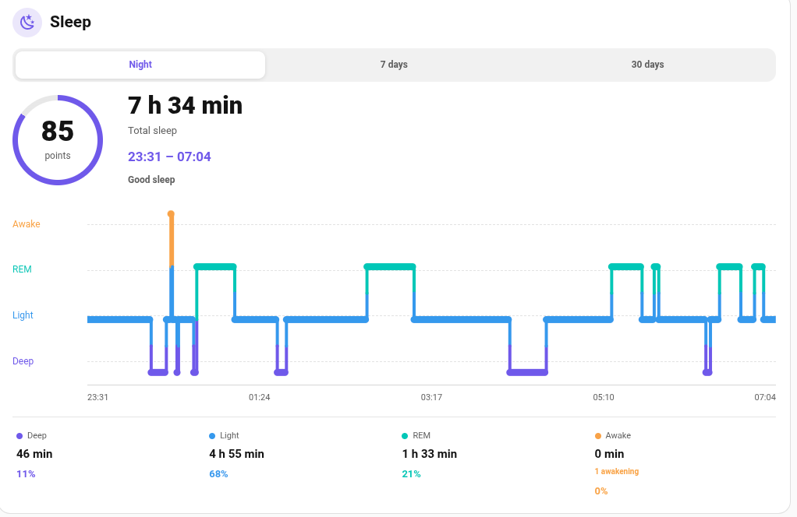
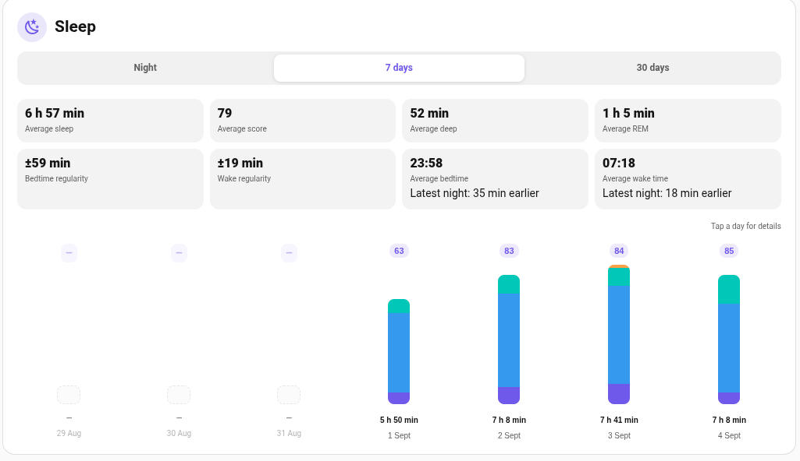
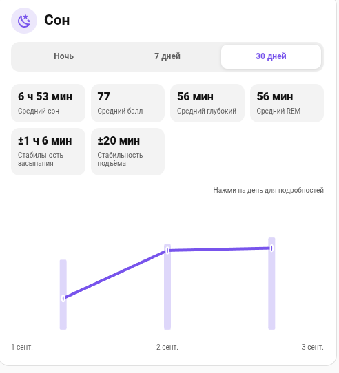
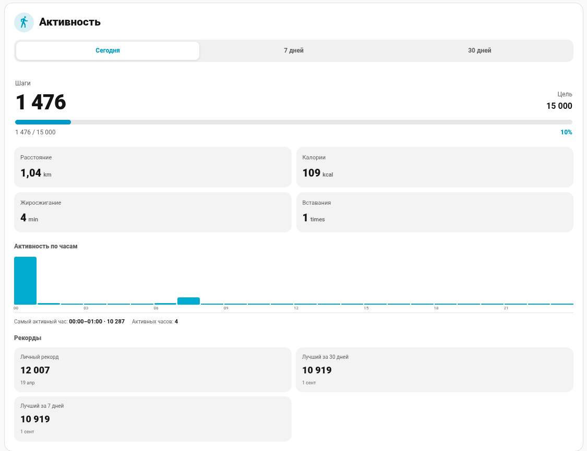
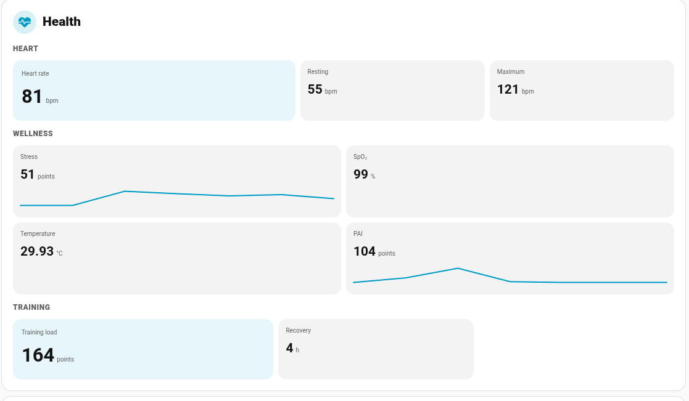
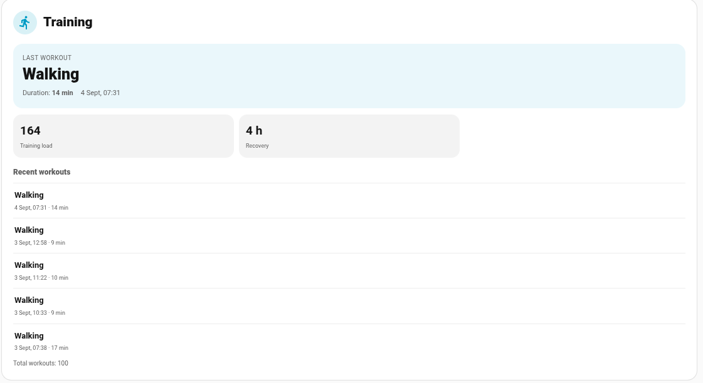

# Zepp2Hass Cards

Community dashboard cards for **Home Assistant**, designed around the entities exposed by the community [Zepp2Hass](https://github.com/davidepalleschi/zepp2hass) integration.

> Independent community frontend project. Not an official Zepp, Amazfit, Home Assistant, or Zepp2Hass project.

## Cards

| Card | Custom element | Purpose |
|---|---|---|
| Overview | `custom:amazfit-overview-card` | Current-day steps, Sleep Score, HR, PAI and recovery at a glance |
| Sleep | `custom:amazfit-sleep-card` | Night hypnogram, stages, score, 7/30-day history, zoom/pan, regularity |
| Activity | `custom:amazfit-activity-card` | Steps, goals, 7/30-day history, records, hourly activity profile |
| Health | `custom:amazfit-health-card` | HR, stress, SpO2, temperature, PAI, training/recovery telemetry |
| Training | `custom:amazfit-training-card` | Last/recent workouts, training load, recovery and VO2 Max |
| Family Activity | `custom:family-activity-card` | Absolute-step family leaderboard using arbitrary HA step sensors |

All cards are designed for graphical Home Assistant configuration. YAML remains available for advanced/manual overrides.

## Screenshots

### Sleep

| Night | 7 days | 30 days |
|---|---|---|
|  |  |  |

### Activity, health and training

| Activity today | Health | Training |
|---|---|---|
|  |  |  |

## Highlights

### Registry-based Zepp2Hass discovery

Sleep, Activity, Health and Training use Home Assistant's entity registry to discover related Zepp2Hass entities. Discovery is scoped primarily by the same Zepp2Hass `config_entry_id`, rather than by a watch model name or a guessed entity-id prefix.

This handles cases such as Home Assistant suffixing an entity to `distance_2`, and Zepp2Hass training entities being associated with another HA `device_id` while still belonging to the same config entry.

### Sleep interactions

Night hypnogram:
- mouse wheel zoom (1x–8x);
- two-finger pinch zoom;
- pan while zoomed;
- hover/tap exact stage/time inspection;
- double click/double tap reset.

7/30-day views support day/bar drill-down into a historical night.

### Family ranking

Family Activity is deliberately independent from Zepp2Hass. Each participant only needs a Home Assistant step sensor.

- rank is always based on **absolute steps**;
- personal target percentage is display-only;
- ties use competition ranking (`1, 1, 3`);
- places 1–3 use CSS gold/silver/bronze medals.

## Installation

### HACS custom repository

1. Open HACS.
2. Add the custom repository:
   `https://github.com/Psix-anp/zepp2hass-cards`
3. Category: Dashboard / Plugin (wording depends on HACS UI).
4. Install **Zepp2Hass Cards**.
5. Refresh Home Assistant if requested.

HACS delivers the root bundle `zepp2hass-cards.js`.

### Manual

Copy `zepp2hass-cards.js` to:

```text
/config/www/zepp2hass-cards/zepp2hass-cards.js
```

Add a JavaScript Module resource:

```text
/local/zepp2hass-cards/zepp2hass-cards.js
```

Hard-refresh the browser after replacing the bundle.

## Basic YAML examples

Normally use the graphical editor. Example seeds are shown only for manual setup.

```yaml
# Overview
type: custom:amazfit-overview-card
entity: sensor.my_watch_steps
language: auto

# Sleep
type: custom:amazfit-sleep-card
entity: sensor.my_watch_sleep_score
language: auto
```

```yaml
# Activity
type: custom:amazfit-activity-card
steps_entity: sensor.my_watch_steps
language: auto
```

```yaml
# Health
type: custom:amazfit-health-card
heart_rate_entity: sensor.my_watch_heart_rate
language: auto
```

```yaml
# Training
type: custom:amazfit-training-card
last_workout_entity: sensor.my_watch_last_workout
language: auto
```

```yaml
# Family Activity
type: custom:family-activity-card
language: auto
participants:
  - id: adult
    name: Adult
    steps_entity: sensor.adult_steps
    target_mode: entity
  - id: child
    name: Child
    steps_entity: sensor.child_steps
    target_mode: manual
    manual_target: 8000
```

## Recorder requirements

- Sleep 7/30-day views use recorded Sleep Score states and attributes.
- Activity 7/30-day views use Recorder daily step statistics.
- Activity hourly profile uses today's recorded step-state history plus the live value.
- Family Week/Month uses completed-day statistics plus the live current-day step value.

The cards do not invent historical totals from arbitrary snapshots when Recorder/statistics data is unavailable.

## Health disclaimer

Displayed health values are smartwatch telemetry for Home Assistant dashboards. The cards do not provide diagnosis or medical advice.

## Development

Node.js 22+:

```bash
npm run check
```

## License

MIT
